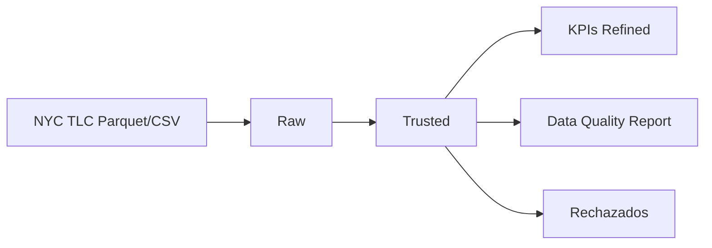

# NYC Taxi ETL Pipeline

Pipeline ETL en Databricks con arquitectura Medallion (Raw -> Trusted -> Refined) usando Unity Catalog. Datos publicos de taxis amarillos de NYC (enero 2023).

Prueba tecnica — Ingeniero de Datos Senior, QUIND S.A.S.

---

## Estructura

```
notebooks/
  00_setup_unity_catalog.ipynb    # Crea catalogo, schemas y permisos
  01_raw_ingestion.ipynb          # Descarga parquet/csv y carga a raw
  02_trusted_transformation.ipynb # Limpieza, validacion, enriquecimiento
  03_refined_kpis.ipynb           # KPIs de demanda, eficiencia y calidad
  04_data_quality_report.ipynb    # Expectations y reporte de calidad

config/pipeline_config.py        # Constantes (umbrales, URLs, nombres de tablas)
resources/nyc_taxi_job.yml       # Definicion del workflow en Databricks
docs/                            # CDEs, glosario, lineage
```

## Como ejecutar

Se necesita un workspace de Databricks con Unity Catalog habilitado.

1. Clonar el repo en Databricks (Workspace -> Git folder)
2. Ejecutar los notebooks en orden: 00 -> 01 -> 02 -> 03/04

Los notebooks 03 y 04 son independientes entre si, ambos leen de trusted. Los datos se descargan solos desde las URLs publicas de NYC TLC, no hay que configurar nada extra.

Opcionalmente se puede crear un job en Workflows replicando el DAG de `resources/nyc_taxi_job.yml`.

## Arquitectura

```
Parquet (NYC TLC) ──> raw.yellow_taxi_trips ──> trusted.yellow_taxi_trips_clean ──> refined.kpi_*
CSV (Zone Lookup) ──> raw.taxi_zone_lookup ──┘  trusted.yellow_taxi_trips_rejected
```

- **Raw**: datos tal cual llegan, sin transformar. Delta con time travel para auditorias.
- **Trusted**: aqui se aplican todas las reglas de calidad. Los registros que no pasan van a una tabla de rechazados con la razon del rechazo, no se eliminan.
- **Refined**: tablas listas para consumo. KPIs calculados y reporte de calidad.

## Validaciones

Los registros invalidos van a `trusted.yellow_taxi_trips_rejected` con una columna `rejection_reason`. Se aplica la primera regla que falla para evitar doble conteo.

Algunas reglas:
- pickup tiene que ser antes que dropoff
- distancia > 0 y <= 200 millas
- tarifa > 0 y <= 500 USD
- duracion entre 1 y 300 minutos
- pasajeros <= 6
- solo registros de enero 2023

Para nulos: `passenger_count` default 1, `ratecode_id` default 99, `payment_type` default 0, surcharges default 0.0.

## KPIs

**KPI 1 - Demanda temporal** (`refined.kpi_demand_pattern`): viajes, duracion y tarifa promedio por franja horaria y dia de la semana. Las combinaciones en el percentil 80 se marcan como pico.

**KPI 2 - Eficiencia por zona** (`refined.kpi_economic_efficiency`): revenue por milla, velocidad promedio y ranking de zonas mas rentables.

**KPI 3 - Impacto de calidad** (`refined.kpi_data_quality_impact`): porcentaje de registros descartados por regla y cuanto representan en ingresos perdidos.

## Performance

- Modo `overwrite` en todas las tablas (en produccion seria merge/append incremental)
- `OPTIMIZE + Z-ORDER` despues de cada escritura para compactar small files
- Sin `repartition` porque con ~3M registros no hace falta, Delta lo maneja bien

## Gobierno de datos

- Unity Catalog con catalogo `nyc_taxi_leonardoaguilera` y 3 schemas (raw, trusted, refined)
- CDEs documentados en `docs/cdes.md`
- Glosario de negocio en `docs/glosario.md`
- Lineaje en `docs/lineage.md`
- Todas las tablas con properties: owner, data_classification, quality_tier, retention_days
- Reporte de ejecucion persistido en `refined.pipeline_execution_report`

## Flujo general



## Stack

Databricks (Free Edition), PySpark, Delta Lake, Unity Catalog, Git/GitHub.

---

Leonardo Aguilera
