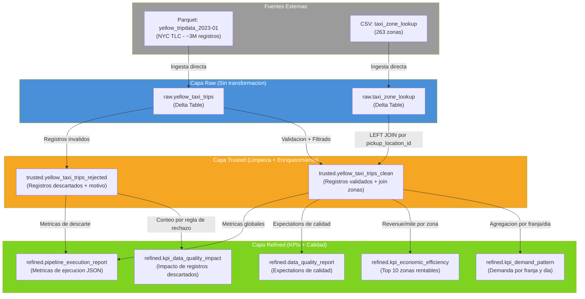

# Linaje de Datos — NYC Taxi Pipeline

Diagrama del flujo de datos desde las fuentes externas hasta la capa Refined.

## Diagrama de Linaje (Mermaid)

## Transformaciones por Capa

| Capa | Entrada | Transformacion | Salida |
|------|---------|----------------|--------|
| **Raw** | Parquet (URL publica) | Ninguna (tipado basico) | `raw.yellow_taxi_trips` |
| **Raw** | CSV (URL publica) | Ninguna (inferSchema) | `raw.taxi_zone_lookup` |
| **Trusted** | raw.yellow_taxi_trips + raw.taxi_zone_lookup | Validacion, limpieza nulos, filtrado outliers, JOIN, renombrado columnas, calculo duracion | `trusted.yellow_taxi_trips_clean` |
| **Trusted** | raw.yellow_taxi_trips (rechazados) | Etiquetado con `rejection_reason` | `trusted.yellow_taxi_trips_rejected` |
| **Refined** | trusted.yellow_taxi_trips_clean | Agregacion por franja horaria y dia | `refined.kpi_demand_pattern` |
| **Refined** | trusted.yellow_taxi_trips_clean | Revenue/mile y velocidad por zona | `refined.kpi_economic_efficiency` |
| **Refined** | trusted.yellow_taxi_trips_rejected | Conteo e impacto por regla | `refined.kpi_data_quality_impact` |
| **Refined** | trusted.yellow_taxi_trips_clean | 2 expectations de calidad | `refined.data_quality_report` |
